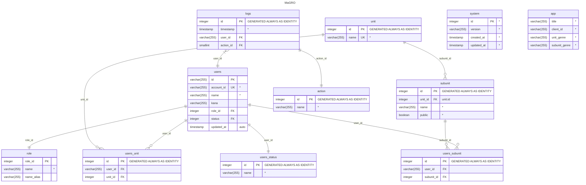

```mermaid
---
title: "MaGRO"
---
erDiagram

users ||--|| role: "role_id"
users || -- || users_status: "user_id"
users ||--o{ users_unit: "user_id"
unit ||--o{ users_unit: "unit_id"
users ||--o{ users_subunit: "user_id"
subunit ||--o{ users_subunit: "subunit_id"
unit ||--o{ subunit: "subunit_id"
logs }|--|| users: "user_id"
logs ||--|| action: "action_id"

system{
  integer id PK "*"
  varchar(255) version "*"
  timestamp created_at "*"
  timestamp updated_at "*"
}

app{
  varchar(255) title "*"
  varchar(255) client_id "*"
  varchar(255) unit_genre "*"
  varchar(255) subunit_genre "*"
}

users_unit {
  integer id PK "GENERATED ALWAYS AS IDENTITY"
  varchar(255) user_id FK
  integer unit_id FK
}

users {
  varchar(255) id PK
  varchar(255) account_id UK "*"
  varchar(255) name "*"
  varchar(255) kana
  integer role_id FK
  integer status FK
  timestamp updated_at "auto"
}

users_subunit{
  integer id PK "GENERATED ALWAYS AS IDENTITY"
  varchar(255) user_id FK
  integer subunit_id FK
}


unit {
  integer id PK "GENERATED ALWAYS AS IDENTITY"
  varchar(255) name UK "*"
}

subunit {
  integer id PK "GENERATED ALWAYS AS IDENTITY"
  integer unit_id FK "unit.id"
  varchar(255) name "*"
  boolean public "*"
}


users_status{
  integer id PK "GENERATED ALWAYS AS IDENTITY"
  varchar(255) name "*"
}


role {
  integer role_id PK
  varchar(255) name "*"
  varchar(255) name_alias 
}


action {
  integer id PK "GENERATED ALWAYS AS IDENTITY"
  varchar(255) name "*"
}


logs {
  integer id PK "GENERATED ALWAYS AS IDENTITY"
  timestamp timestamp "*"
  varchar(255) user_id FK
  smallint action_id FK
}

```
