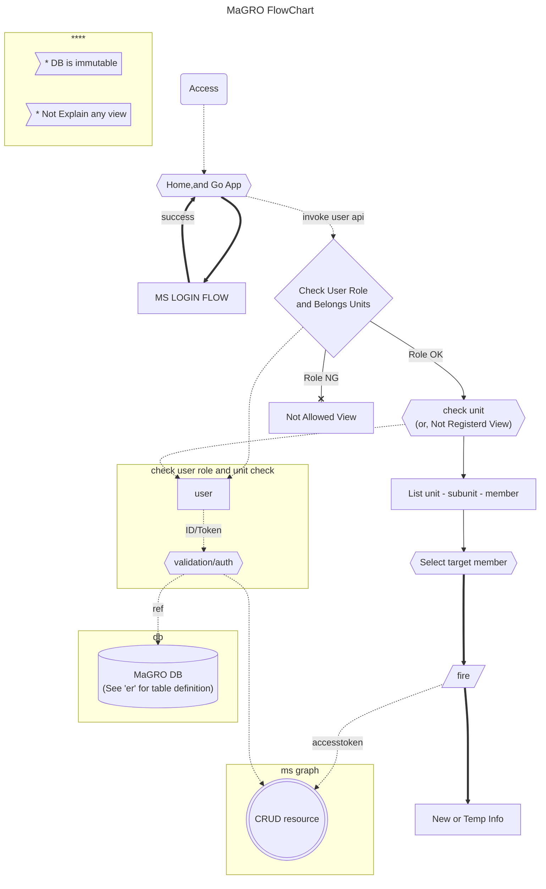

```mermaid
---
title: MaGRO FlowChart
---
flowchart TD

subgraph ****
  m1>* DB is immutable]
  m2>* Not Explain any view]
end


subgraph db
  DB[("MaGRO DB <br> (See 'er' for table definition)")]
end

subgraph ms graph
  MSG(((CRUD resource)))
end

START(Access)-.->App1{{Home,and Go App}}
App1==>M[MS LOGIN FLOW]== success ==>App1
App1-.invoke user api.->Check1{Check User Role <br> and Belongs Units}
Check1-.->a1
Check1-->|Role OK| App2{{"check unit <br> (or, Not Registerd View)"}}
App2-.->a1
Check1--x|Role NG| NGV1[Not Allowed View]
App2-->App3[List unit - subunit - member]-->App4{{Select target member}}
App4==>App5[/fire/]==>App6[New or Temp Info]
App5-.accesstoken.->MSG

subgraph check user role and unit check
a1[user]-.ID/Token.->a2{{validation/auth}}
a2-.->MSG
a2-.ref.->DB
end

```