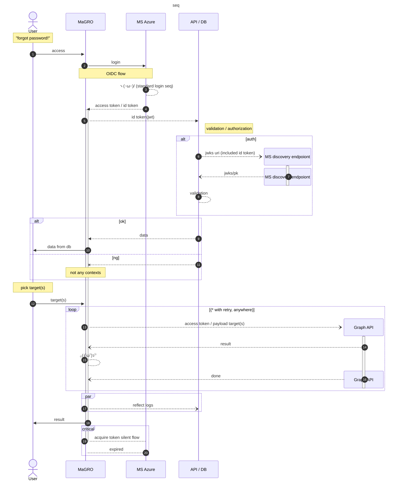

```mermaid
---
title: "seq"
---
sequenceDiagram
autonumber
actor User
Note over User: "forgot password!"
participant MaGRO
participant MS Azure
participant API / DB

User->>+MaGRO: access
MaGRO->>MS Azure: login
Note over MaGRO,MS Azure: OIDC flow
MS Azure --> MS Azure: ヽ(･ω･)/ (standard login seq)
MS Azure -->>+ MaGRO: access token / id token
MaGRO -->> API / DB: id token(jwt)
Note right of API / DB: validation / authorization

alt auth
  create participant MS discovery endpoiont
  API / DB--)+ MS discovery endpoiont: jwks uri (included id token)
  destroy MS discovery endpoiont
  MS discovery endpoiont --)- API / DB: jwks/pk
  API / DB --> API / DB: validation
end


alt ok
  API / DB-->>MaGRO: data
  MaGRO->>User: data from db
else ng
  API / DB--xMaGRO: 
  Note over MaGRO: not any contexts
end
Note over User: pick target(s)
User->>MaGRO: target(s)
loop (* with retry, anywhere)
  create participant Graph API
  MaGRO--)+Graph API: access token / payload target(s)
  Graph API --) MaGRO: result
  MaGRO --> MaGRO: ₍₍(ง˘ω˘)ว⁾⁾
  destroy Graph API
  Graph API --)- MaGRO: done
end
par 
MaGRO --) API / DB: reflect logs
end
MaGRO ->> User: result 

critical
  MaGRO -->- MS Azure: acquire token silent flow 
  MS Azure --> MaGRO: expired
end
```

